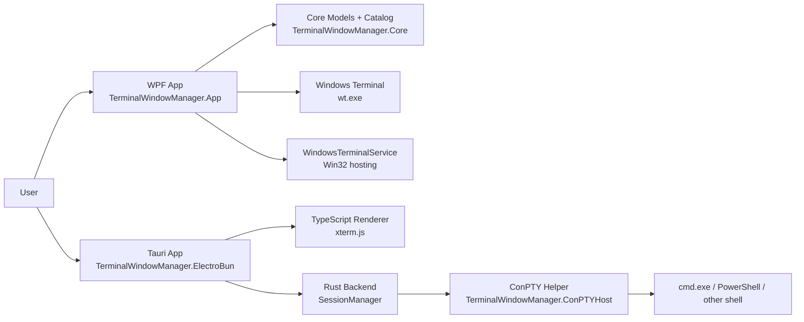
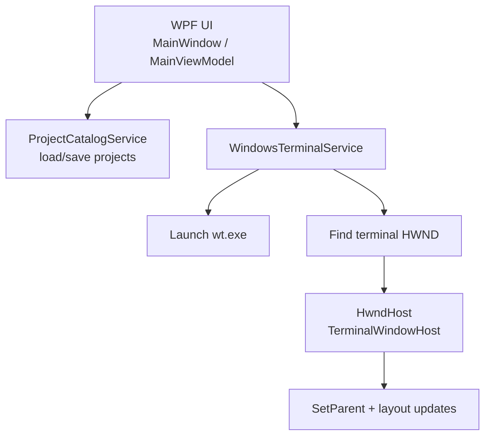
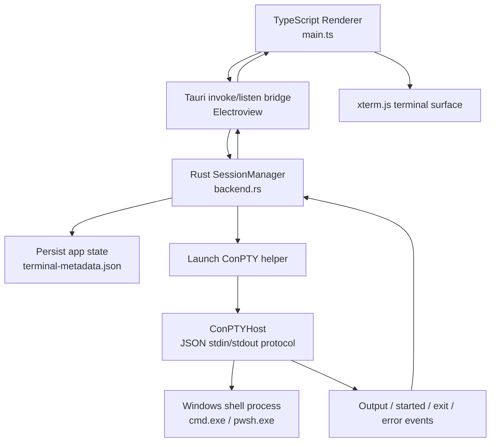

# System Architecture

## Overview

Terminal Window Manager currently contains two desktop architectures in the same repository:

- A WPF-based Windows application that launches and hosts external Windows Terminal windows.
- A Tauri-based desktop application that renders its own terminal UI with `xterm.js` and drives shell sessions through a dedicated ConPTY helper process.

The project folder [src/TerminalWindowManager.ElectroBun](../../src/TerminalWindowManager.ElectroBun) still carries the historical `ElectroBun` name, but the active desktop shell inside that folder is now Tauri-based. The old name remains in folder names and a few compatibility-oriented abstractions such as `Electroview`, but the current implementation uses Tauri, Rust, TypeScript, and `xterm.js`.

The result is a mixed architecture:

- The WPF path is oriented around controlling and embedding an external terminal application.
- The Tauri path is oriented around owning the terminal session lifecycle directly.

Those two paths share the repository, but they do not currently share one common runtime backend.

## Project Roles

### [TerminalWindowManager.Core](../../src/TerminalWindowManager.Core)

Role:

- Shared C# domain model and services for the original WPF architecture.

What it contains:

- Project and terminal models such as `TerminalProject` and `ManagedTerminalTab`.
- `ObservableObject` infrastructure for data binding.
- `ProjectCatalogService` for persistence to `%LOCALAPPDATA%\TerminalWindowManager\projects.json`.
- The `IWindowsTerminalService` abstraction used by the WPF app.

Why it exists:

- It isolates UI-independent state and persistence from the WPF shell.
- It gives the WPF app a small service boundary instead of hard-coding Win32 interop everywhere.

### [TerminalWindowManager.Terminal](../../src/TerminalWindowManager.Terminal)

Role:

- Windows Terminal integration layer for the WPF application.

What it contains:

- `WindowsTerminalService`, which launches `wt.exe`.
- Win32 interop for finding top-level Windows Terminal windows.
- `SetParent`-based window hosting and layout updates.

Why it exists:

- The original product concept was not to implement a terminal emulator, but to organize and host Windows Terminal windows inside a manager UI.
- This project encapsulates the fragile Windows-specific window-hosting logic away from the WPF shell.

### [TerminalWindowManager.App](../../src/TerminalWindowManager.App)

Role:

- The original desktop shell implemented in WPF.

What it contains:

- `MainViewModel` for project and terminal management.
- `TerminalWindowHost`, an `HwndHost` used to embed hosted terminal windows.
- XAML views and WPF command wiring.

Why it exists:

- WPF is well-suited to native Windows desktop UI, data binding, and `HwndHost` interop.
- This path depends on Windows-native hosting because its terminal content is owned by an external process.

### [TerminalWindowManager.ConPTYHost](../../src/TerminalWindowManager.ConPTYHost)

Role:

- Dedicated helper process that owns a ConPTY pseudoconsole session.

What it contains:

- `ConPtySession` for Win32 pseudoconsole setup.
- A JSON line protocol over stdin/stdout.
- Shell startup, resize, input, shutdown, and output event handling.

Why it exists:

- The Tauri app needs a native process boundary between the desktop shell and the terminal session.
- ConPTY is Windows-specific and stateful; isolating it in a helper process reduces coupling to the desktop host and makes failures easier to diagnose.
- The helper can be reused across different desktop shells as long as they speak the same protocol.

### [TerminalWindowManager.ElectroBun](../../src/TerminalWindowManager.ElectroBun)

Role:

- Current cross-technology desktop shell project.

What it contains now:

- A TypeScript renderer in [src/mainview](../../src/TerminalWindowManager.ElectroBun/src/mainview).
- Shared frontend/backend TypeScript contracts in [src/shared](../../src/TerminalWindowManager.ElectroBun/src/shared).
- A Rust Tauri backend in [src-tauri](../../src/TerminalWindowManager.ElectroBun/src-tauri).
- Tauri config, capabilities, and packaging.

What it contains historically:

- Legacy ElectroBun naming and configuration in [electrobun.config.ts](../../src/TerminalWindowManager.ElectroBun/electrobun.config.ts).
- Build artifacts and naming that indicate the folder was originally built around ElectroBun before the migration to Tauri.

Why it exists:

- It is the modern shell path that replaces Windows Terminal hosting with an application-owned terminal experience.
- It separates the terminal UI from the shell process, while keeping a web-based renderer and native desktop shell.

## Runtime Architecture

### High-Level Context

This repository therefore supports two fundamentally different terminal ownership models:

- WPF owns the manager UI, but not the terminal process or rendering surface.
- Tauri owns the manager UI, the terminal renderer, and the session lifecycle, but delegates pseudoconsole handling to the helper process.

### WPF Path

Summary:

- Projects and terminal definitions are managed in C#.
- When a terminal is activated, the app launches or locates a Windows Terminal window.
- The external window is reparented into the WPF shell.

Architectural implication:

- This design is pragmatic for Windows-native integration, but fragile because it depends on hosting a foreign top-level window that the application does not truly own.

### Tauri Path

Summary:

- The renderer owns the project tree, status UI, settings, and terminal surface.
- The Rust backend owns terminal definitions, session state, helper discovery, and desktop window commands.
- The C# helper owns pseudoconsole creation and shell process I/O.

Architectural implication:

- This design is more cohesive than the WPF path because the app owns the terminal UI and session protocol directly.
- It is still polyglot and somewhat duplicated because state models now exist separately in C# and Rust.

## ElectroBun vs Tauri

### What Stayed The Same

- The project folder [src/TerminalWindowManager.ElectroBun](../../src/TerminalWindowManager.ElectroBun) remained the home of the web-based desktop shell.
- The UI still uses TypeScript and `xterm.js`.
- The ConPTY helper remained the Windows-native execution boundary for shell sessions.
- The product direction stayed focused on a custom terminal manager UI rather than a plain wrapper over `wt.exe`.

### What Changed

- ElectroBun packaging/runtime was replaced by Tauri packaging/runtime.
- A Rust backend now sits between the web renderer and the helper process.
- The desktop shell now uses Tauri `invoke` commands and event listeners instead of the previous ElectroBun host integration.
- Tauri capabilities and window permissions now matter for operations such as dragging, window controls, and event delivery.

### Why Tauri Fits Better Than ElectroBun Here

- Tauri gives a clear native backend boundary in Rust for session lifecycle, helper resolution, persistence, and desktop APIs.
- The web UI can remain in TypeScript without owning low-level desktop responsibilities.
- Tauri packaging is closer to a conventional native desktop application model than the previous setup.
- The command and event bridge is explicit, which makes system behavior easier to reason about than implicit host integration.

### Why The Historical ElectroBun Naming Still Matters

- The folder name can mislead maintainers into thinking the runtime is still ElectroBun-first.
- Compatibility names such as `Electroview` obscure that the current bridge is Tauri-specific.
- Build and release discussions still need to distinguish between historical ElectroBun artifacts and the actual Tauri architecture.

## Technology Placement And Rationale

### C#

Used in:

- [TerminalWindowManager.Core](../../src/TerminalWindowManager.Core)
- [TerminalWindowManager.Terminal](../../src/TerminalWindowManager.Terminal)
- [TerminalWindowManager.App](../../src/TerminalWindowManager.App)
- [TerminalWindowManager.ConPTYHost](../../src/TerminalWindowManager.ConPTYHost)

Why:

- The original system is Windows-first and desktop-native.
- WPF and Win32 interop are natural fits in .NET on Windows.
- The ConPTY helper already uses Windows APIs directly and fits well in a focused .NET executable.

### Rust

Used in:

- [TerminalWindowManager.ElectroBun/src-tauri](../../src/TerminalWindowManager.ElectroBun/src-tauri)

Why:

- Tauri expects a Rust backend.
- Rust is a good fit for a stateful desktop host that manages native resources and process orchestration.
- It gives the web renderer a narrow, explicit command surface.

### TypeScript

Used in:

- [TerminalWindowManager.ElectroBun/src/mainview](../../src/TerminalWindowManager.ElectroBun/src/mainview)
- [TerminalWindowManager.ElectroBun/src/shared](../../src/TerminalWindowManager.ElectroBun/src/shared)

Why:

- It is productive for complex interactive UI.
- `xterm.js` is already a browser-side terminal renderer.
- The custom sidebar, dialogs, and window chrome are easier to iterate on in a web stack than in a native terminal host.

### WPF

Used in:

- [TerminalWindowManager.App](../../src/TerminalWindowManager.App)

Why:

- It provides mature Windows desktop UI patterns and `HwndHost`.
- It is specifically useful when the application is embedding foreign native windows.

### xterm.js

Used in:

- [src/mainview/main.ts](../../src/TerminalWindowManager.ElectroBun/src/mainview/main.ts)

Why:

- It gives the Tauri path a real terminal surface inside the app rather than embedding another app window.
- It aligns well with a web renderer architecture and explicit session protocol.

## State And Persistence

The repository currently has two separate persistence stories:

- The WPF path stores project catalog data in `%LOCALAPPDATA%\TerminalWindowManager\projects.json`.
- The Tauri path stores app state in the Tauri app data directory as `terminal-metadata.json`.

This is an important architectural boundary:

- The WPF app persists C# project models meant for Windows Terminal hosting.
- The Tauri app persists Rust models meant for ConPTY-backed internal sessions.

Those are conceptually similar, but not actually one shared domain model.

## Main Architectural Differences Between The Two Paths

### Terminal Ownership

- WPF delegates terminal execution and rendering to Windows Terminal.
- Tauri owns the terminal renderer and session orchestration, then delegates only the pseudoconsole mechanics to the helper.

### Failure Surface

- WPF is sensitive to external window discovery, HWND parenting, and Windows Terminal behavior.
- Tauri is sensitive to helper discovery, session protocol correctness, event delivery, and web/native bridge wiring.

### Flexibility

- WPF is constrained by what Windows Terminal exposes.
- Tauri can evolve terminal UX, telemetry, settings, and session lifecycle independently.

### Platform Coupling

- Both paths are Windows-only today.
- The WPF path is even more tightly coupled to Windows-specific UI hosting.
- The Tauri path is architecturally more portable at the UI layer, but still anchored to Windows through ConPTY and the helper.

## Current Structural Strengths

- The repository clearly separates the helper process from the desktop host.
- The Tauri path has a stronger ownership model for terminal state than the WPF path.
- The WPF path keeps its Windows Terminal hosting code isolated in a dedicated project.
- The TypeScript renderer and Rust backend communicate through explicit contracts rather than shared mutable state.

## Current Structural Weaknesses

- The repository maintains two desktop architectures with overlapping concepts and different persistence models.
- The `ElectroBun` folder name no longer matches the active runtime technology.
- Core state concepts are duplicated across C# and Rust instead of being defined once and projected into each runtime.
- The build and packaging story for the helper is still operationally delicate because desktop hosts need to discover the helper correctly in multiple environments.

## Recommendations

### 1. Choose One Strategic Desktop Shell

The most important architecture decision is whether the WPF path is still strategic.

If Tauri is the future:

- Treat WPF as legacy.
- Stop expanding the WPF-specific model and hosting behavior.
- Focus architectural investment on the Tauri path and the helper protocol.

If both must remain:

- Explicitly document them as separate products with separate lifecycle expectations.

### 2. Define One Canonical Domain Model

Right now, the repository has:

- C# models for projects and terminals in the WPF path.
- Rust models for projects, terminals, status, diagnostics, and defaults in the Tauri path.
- TypeScript mirrors of the Rust model for the renderer.

Recommended change:

- Define one canonical application-state contract.
- Generate or validate language-specific projections from that contract.
- Keep UI-only fields local to each frontend, but keep durable state and session protocol shared by design.

### 3. Make The ConPTY Protocol A First-Class Boundary

The helper process is already a true subsystem.

Recommended change:

- Document its stdin/stdout protocol as an explicit contract.
- Version the protocol.
- Add focused tests around startup, resize, input, exit, and error events.

That would reduce regressions in the exact area that has recently been fragile.

### 4. Rename The Tauri Shell Project

The current folder name is historically accurate but architecturally misleading.

Recommended options:

- Rename the folder to `TerminalWindowManager.Tauri`.
- Keep a short migration note explaining the former ElectroBun origin.

This will make build scripts, documentation, and mental models much clearer.

### 5. Separate Build Inputs From Runtime Resources More Clearly

The helper packaging path has been a recurring source of issues.

Recommended change:

- Treat copied helper binaries as build outputs only, not source-controlled content.
- Keep resource staging deterministic and explicit in one place.
- Add a build verification step that asserts the helper can be resolved in dev and packaged modes.

### 6. Add Architecture-Level Tests

The repo currently relies heavily on manual verification.

Recommended priorities:

- Session manager tests in Rust.
- Protocol-level tests for the helper.
- Small integration checks for dev and packaged helper discovery.
- Snapshot or schema validation for the TypeScript/Rust state contract.

## Recommended Direction

If the goal is a durable long-term architecture, the strongest direction is:

1. Standardize on the Tauri path as the primary desktop shell.
2. Keep `ConPTYHost` as a dedicated subsystem with an explicit protocol contract.
3. Retire or freeze the WPF/Windows Terminal hosting path unless it serves a specific migration need.
4. Unify domain state across Rust and TypeScript, and reduce duplicated modeling across the repository.

That direction aligns the product around owning terminal UX directly instead of trying to host another terminal application inside a manager shell.
