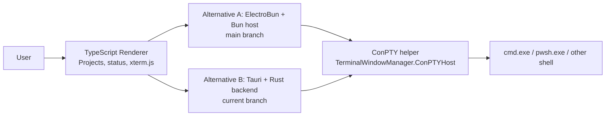
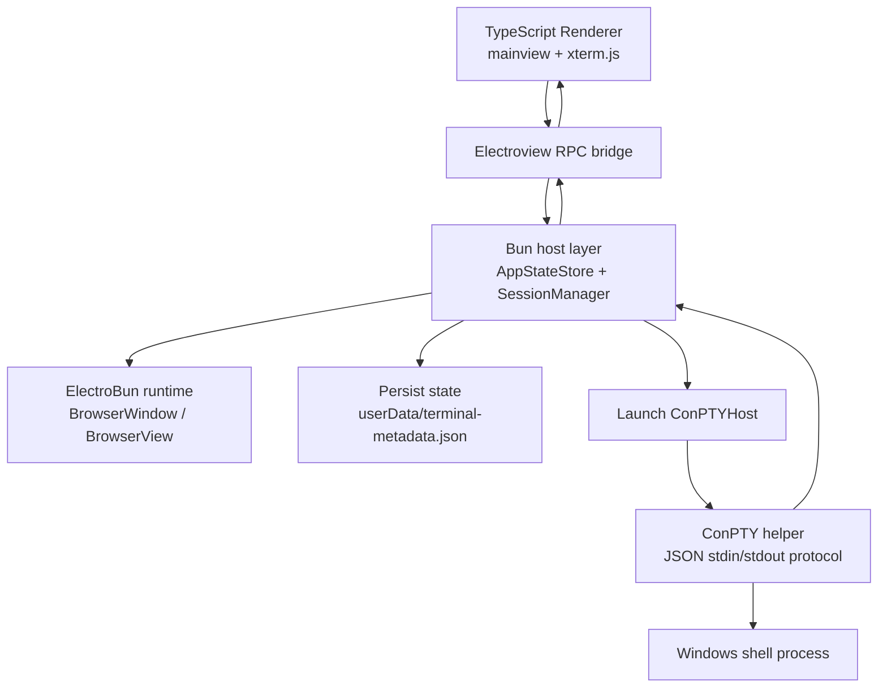
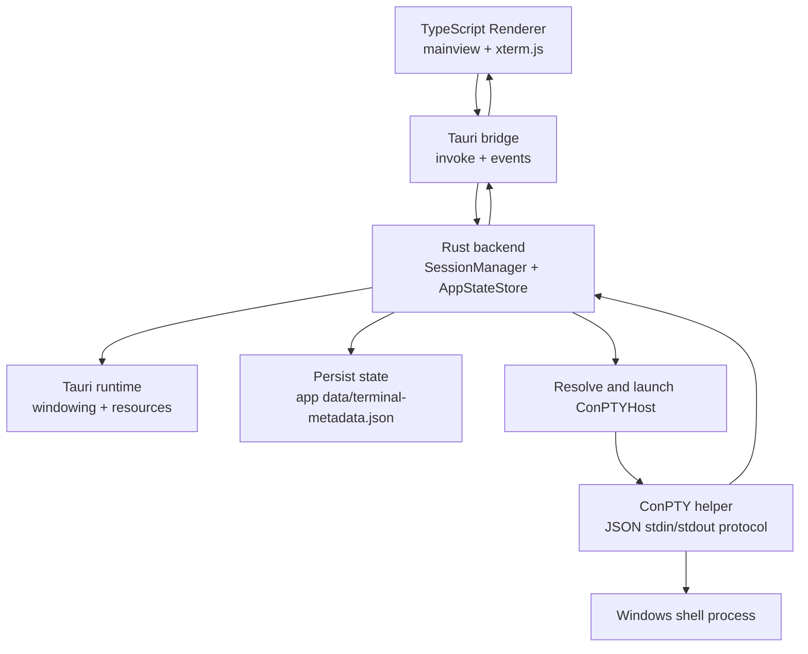

# System Architecture

## Purpose

This document compares two viable web-native desktop shell architectures for Terminal Window Manager:

- The current branch architecture, which uses Tauri as the desktop runtime and Rust as the native backend.
- The `main` branch architecture, which uses ElectroBun as the desktop runtime and Bun as the host-side backend.

Both alternatives share the same product goal:

- Present a project-oriented terminal manager UI.
- Render terminal content inside the application with `xterm.js`.
- Drive real shell sessions through the native [TerminalWindowManager.ConPTYHost](../../src/TerminalWindowManager.ConPTYHost) process.

The older WPF path in [TerminalWindowManager.App](../../src/TerminalWindowManager.App), [TerminalWindowManager.Core](../../src/TerminalWindowManager.Core), and [TerminalWindowManager.Terminal](../../src/TerminalWindowManager.Terminal) still exists in the repository, but it is not the main subject of this comparison. It is best understood as an earlier Windows-native product line rather than one of the two web-native shell alternatives.

## System Context

At a high level, both alternatives follow the same product shape:

- A TypeScript renderer owns the visible terminal manager UI.
- A desktop host layer owns application lifecycle, persistence, window integration, and session orchestration.
- The C# ConPTY helper owns pseudoconsole creation and shell process I/O.

The main architectural difference is therefore not the renderer or the shell helper. The difference is the host layer in the middle:

- On `main`, the host layer is implemented in Bun and runs inside the ElectroBun runtime.
- On the current branch, the host layer is implemented in Rust and runs inside the Tauri runtime.

## Involved Projects

### [TerminalWindowManager.ElectroBun](../../src/TerminalWindowManager.ElectroBun)

Role:

- The desktop shell project for both alternatives, even though the implementation differs by branch.

On `main`:

- It contains the TypeScript renderer.
- It contains a Bun-side host layer that manages state, persistence, sessions, and ElectroBun RPC.
- It packages the app with ElectroBun.

On the current branch:

- It still contains the TypeScript renderer.
- It now contains a Rust backend in [src-tauri](../../src/TerminalWindowManager.ElectroBun/src-tauri).
- It packages the app with Tauri.

Why it matters:

- This is the architectural pivot point of the repository.
- The product surface is similar in both branches, but the native desktop integration model is different.

### [TerminalWindowManager.ConPTYHost](../../src/TerminalWindowManager.ConPTYHost)

Role:

- Shared native helper that owns the Windows ConPTY pseudoconsole session.

What it does:

- Launches the requested shell.
- Connects stdin and stdout to the app host.
- Handles resize, input, shutdown, and startup sequencing.
- Emits structured session lifecycle information and diagnostics.

Why it exists:

- Both alternatives need a Windows-specific terminal execution boundary.
- ConPTY is stateful and native; isolating it in a dedicated process keeps the desktop shell simpler.

### [TerminalWindowManager.App](../../src/TerminalWindowManager.App)

Role:

- Original WPF shell for the earlier Windows Terminal hosting architecture.

Why it still matters:

- It shows the product's original direction.
- It is useful historical context when comparing "embed another terminal app" versus "own the terminal UI directly".
- It is not the primary shell in either of the two alternatives compared here.

### [TerminalWindowManager.Core](../../src/TerminalWindowManager.Core)

Role:

- Shared C# model and service layer for the WPF architecture.

Why it still matters:

- It contains the earlier domain concepts for projects and managed terminals.
- It is an important reminder that the repository currently contains more than one architectural lineage.

### [TerminalWindowManager.Terminal](../../src/TerminalWindowManager.Terminal)

Role:

- Windows Terminal integration layer for the WPF product line.

Why it still matters:

- It is the old answer to terminal execution and hosting.
- It is structurally separate from both the ElectroBun and Tauri alternatives, which instead use `xterm.js` plus `ConPTYHost`.

## Alternative A: ElectroBun Architecture On `main`

The `main` branch ElectroBun architecture is a mostly JavaScript and TypeScript desktop stack:

- TypeScript renderer for the UI.
- Bun host-side runtime for state, persistence, and session orchestration.
- ElectroBun windowing and RPC for the desktop shell.
- C# ConPTY helper for native pseudoconsole handling.

### Runtime Shape

### Host Responsibilities

On `main`, the Bun host layer is responsible for:

- Loading and saving app metadata.
- Owning the project and terminal catalog.
- Launching and tracking live terminal sessions.
- Translating helper events into UI messages.
- Managing desktop window commands such as minimize, maximize, and close.

### Technology Placement

TypeScript and Bun are used heavily here because:

- The renderer and the host can share one language ecosystem.
- UI contracts and host logic can evolve together without crossing a Rust boundary.
- The development model is close to a web-first application with desktop capabilities added by ElectroBun.

### Architectural Strengths

- The host and renderer are conceptually close because both live in the JavaScript and TypeScript world.
- State flow is easy to reason about for a web-heavy team.
- The ConPTY helper remains isolated, so Bun does not need to own Windows pseudoconsole details directly.
- The app is relatively cohesive if the team wants to stay close to Bun and TypeScript.

### Architectural Tradeoffs

- The desktop shell depends on a less common runtime stack than Tauri.
- The host layer mixes application orchestration, desktop integration, and persistence inside the Bun side of the shell.
- Operational concerns such as packaging and resource copying are handled through ElectroBun-specific build behavior.
- The architecture is viable, but it is more specialized and depends more heavily on ElectroBun-specific conventions.

## Alternative B: Tauri Architecture On The Current Branch

The current branch Tauri architecture keeps the same renderer and the same ConPTY helper, but replaces the host layer:

- TypeScript renderer for the UI.
- Rust backend for state, persistence, session orchestration, and native desktop operations.
- Tauri commands and events for the app bridge.
- C# ConPTY helper for native pseudoconsole handling.

### Runtime Shape

### Host Responsibilities

On the current branch, the Rust backend is responsible for:

- Loading and saving app metadata.
- Owning the project and terminal catalog.
- Launching and tracking live terminal sessions.
- Translating helper events into Tauri events.
- Managing desktop window commands and resource lookup.

### Technology Placement

Rust and Tauri are used here because:

- Tauri naturally expects a native backend in Rust.
- Native process management, resource resolution, and lifecycle logic sit behind a narrow host boundary.
- The renderer remains in TypeScript, but low-level desktop responsibilities move out of the web stack.

### Architectural Strengths

- The desktop boundary is explicit: UI in TypeScript, native host in Rust, ConPTY execution in C#.
- Tauri provides a conventional desktop packaging and resource model.
- The event and command surfaces are explicit and easier to isolate operationally.
- The architecture is well-suited for hardening native concerns such as helper discovery, app resources, and startup diagnostics.

### Architectural Tradeoffs

- The system becomes more polyglot: TypeScript, Rust, and C# all carry business-significant logic.
- State models now need to stay aligned across Rust and TypeScript.
- The renderer no longer shares a runtime language with the host layer.
- The team pays a higher cross-language coordination cost than in the ElectroBun alternative.

## Shared Architecture Across Both Alternatives

Even though the host layer changes, several system decisions stay the same:

- The user works with projects and terminals rather than one-off shell windows.
- The renderer owns the visual terminal surface through `xterm.js`.
- Live shell execution is delegated to [TerminalWindowManager.ConPTYHost](../../src/TerminalWindowManager.ConPTYHost).
- The helper and the host communicate through a structured stdin/stdout protocol.
- Diagnostic data and recent session failure context are treated as first-class parts of terminal state.

This is important because it means the architecture change is not a full product rewrite. It is primarily a replacement of the desktop host layer and the IPC model around it.

## Direct Comparison

### Product Shape

Both alternatives deliver the same user-facing concept:

- A desktop app with a custom project tree.
- Terminal tabs represented as managed console records.
- Terminal rendering inside the application rather than through embedded Windows Terminal windows.

The difference is not the feature idea. The difference is which host stack owns the application shell.

### Desktop Runtime

ElectroBun on `main`:

- The runtime is ElectroBun.
- Windowing and host-side RPC are ElectroBun concepts.
- Packaging and copied resources follow ElectroBun build rules.

Tauri on the current branch:

- The runtime is Tauri.
- Windowing, capabilities, resources, and app events are Tauri concepts.
- Packaging and copied resources follow Tauri resource rules.

### Host Language And Responsibility Split

ElectroBun on `main`:

- The host is implemented in Bun and TypeScript.
- State store, session manager, and desktop integration stay near the web stack.

Tauri on the current branch:

- The host is implemented in Rust.
- The renderer becomes more of a client to a native backend rather than sharing the same host language.

### IPC Model

ElectroBun on `main`:

- Uses ElectroBun RPC between Bun and the renderer.
- The bridge feels like one application spread across host and webview code.

Tauri on the current branch:

- Uses `invoke` commands plus named events.
- The bridge is more explicitly command-oriented and transport-oriented.

### State Ownership

ElectroBun on `main`:

- Durable app state is owned in the Bun host layer.
- The renderer consumes and reacts to that state.

Tauri on the current branch:

- Durable app state is owned in the Rust backend.
- The renderer consumes a TypeScript projection of Rust-owned models.

### Packaging And Operational Model

ElectroBun on `main`:

- Relies on ElectroBun-specific build and packaging behavior.
- Helper staging is handled through ElectroBun copy configuration.

Tauri on the current branch:

- Relies on Tauri's resource model and desktop bundle structure.
- Helper staging is handled through Tauri resources plus runtime resolution logic.

### Team Ergonomics

ElectroBun on `main` is a better fit when:

- The team wants the host layer to stay close to TypeScript and Bun.
- Fast iteration in one dominant language is more important than native separation.
- The team is comfortable standardizing on ElectroBun-specific tooling.

Tauri on the current branch is a better fit when:

- The team wants a stronger native host boundary.
- Packaging, resource resolution, and desktop process orchestration need to be hardened as first-class concerns.
- The team is comfortable operating a more explicitly polyglot architecture.

## Technology Placement And Rationale

### TypeScript

Used in both alternatives for:

- The desktop renderer.
- The UI state projection.
- `xterm.js` integration and interaction handling.

Why:

- It is productive for rich interactive desktop UI.
- The project tree, dialogs, status surfaces, and terminal viewport are natural web-style UI concerns.

### `xterm.js`

Used in both alternatives for:

- In-app terminal rendering.

Why:

- It lets the product own the terminal surface directly.
- It removes dependence on embedding a foreign terminal window.

### ElectroBun

Used on `main` for:

- Desktop runtime.
- Window integration.
- Renderer-to-host RPC.

Why:

- It keeps the host close to Bun and TypeScript.
- It offers a web-native desktop development model with relatively little language switching.

### Bun

Used on `main` for:

- Host-side state management.
- Session lifecycle orchestration.
- Metadata persistence and diagnostics flow.

Why:

- It keeps most of the application logic in the same language family as the renderer.

### Tauri

Used on the current branch for:

- Desktop runtime.
- App packaging.
- Command and event bridging.
- Resource and window integration.

Why:

- It provides a clearer native desktop shell boundary.
- It fits well when the host layer needs explicit resource, process, and lifecycle control.

### Rust

Used on the current branch for:

- Host-side state management.
- Session lifecycle orchestration.
- Helper resolution and runtime diagnostics.

Why:

- It is a strong fit for native orchestration work.
- It makes the host layer less dependent on the web runtime.

### C#

Used in [TerminalWindowManager.ConPTYHost](../../src/TerminalWindowManager.ConPTYHost) and the older WPF product line for:

- Windows-native integration.
- Pseudoconsole handling.
- The earlier WPF shell and Windows Terminal hosting logic.

Why:

- The repository is still strongly Windows-oriented.
- ConPTY and the older WPF architecture both fit naturally in .NET.

## How The Older WPF Path Relates To Both Alternatives

The older WPF path is still important context:

- It represents an earlier architecture where the app managed terminal windows instead of rendering the terminal itself.
- It uses [TerminalWindowManager.Terminal](../../src/TerminalWindowManager.Terminal) to launch and host `wt.exe`.
- It depends on Win32 window parenting rather than on `xterm.js` and a ConPTY session protocol.

The ElectroBun and Tauri alternatives should therefore be viewed as two different answers to the same newer architectural decision:

- Own the terminal surface directly.
- Keep shell execution behind a ConPTY helper.
- Use a web-native renderer for the manager UI.

## Recommendations

### 1. Keep The Comparison Explicit In Repository Docs

If both alternatives remain viable references, the repository should say so directly:

- Describe `main` as the ElectroBun-based alternative.
- Describe the current branch as the Tauri-based alternative.
- Avoid implying that the folder name alone describes the runtime model.

That will prevent maintainers from confusing "historical folder name" with "actual host architecture".

### 2. Neutralize The Project Naming

If the project is expected to keep multiple host experiments or migrations, a neutral name would reduce confusion.

Recommended options:

- Rename [TerminalWindowManager.ElectroBun](../../src/TerminalWindowManager.ElectroBun) to a neutral shell name such as `TerminalWindowManager.DesktopShell`.
- Or split the shell implementations into separate project directories if both are meant to live long-term.

### 3. Treat ConPTYHost As A Stable Product Subsystem

Regardless of host choice, [TerminalWindowManager.ConPTYHost](../../src/TerminalWindowManager.ConPTYHost) is shared critical infrastructure.

Recommended changes:

- Write down its protocol as a versioned contract.
- Add tests around startup, resize, input, exit, and error events.
- Keep host-specific glue outside the helper protocol itself.

### 4. Define One Canonical State Contract

Both alternatives model nearly the same domain:

- Projects.
- Terminals.
- Activity and session lifecycle.
- Diagnostics and failure summaries.

Recommended change:

- Define one canonical app-state contract and validate each host against it.

That recommendation helps both alternatives:

- ElectroBun benefits because host and renderer stay aligned more safely.
- Tauri benefits because Rust and TypeScript projections stay aligned more safely.

### 5. Evaluate The Host Choice By Team And Operations, Not By UI

The renderer story is already similar in both branches. The real decision is the host layer.

Recommended evaluation criteria:

- Choose ElectroBun if end-to-end TypeScript and Bun ergonomics are the priority.
- Choose Tauri if native hardening, explicit resource handling, and a clearer host boundary are the priority.

### 6. If Both Alternatives Continue, Separate Their Operational Pipelines

If both architectures are kept alive as real options, they should not rely on ambiguous shared assumptions.

Recommended change:

- Give each alternative its own build, packaging, and release expectations.
- Make helper staging and runtime resource lookup explicit per host runtime.
- Avoid mixed documentation that talks about one shell while assuming the packaging model of the other.

## Recommended Direction

At the system level, the strongest long-term pattern is already visible in both alternatives:

- Keep the renderer web-native.
- Keep terminal rendering inside the app with `xterm.js`.
- Keep ConPTY execution behind a dedicated helper.
- Keep the desktop host layer small, explicit, and replaceable.

That means the most valuable architectural question is not "ElectroBun or Tauri?" in isolation. It is:

- Which host runtime is the best long-term owner of state, lifecycle, packaging, and native desktop behavior for this product?

This document should therefore be used as a comparison of two valid host-layer designs built around one shared terminal product architecture.
