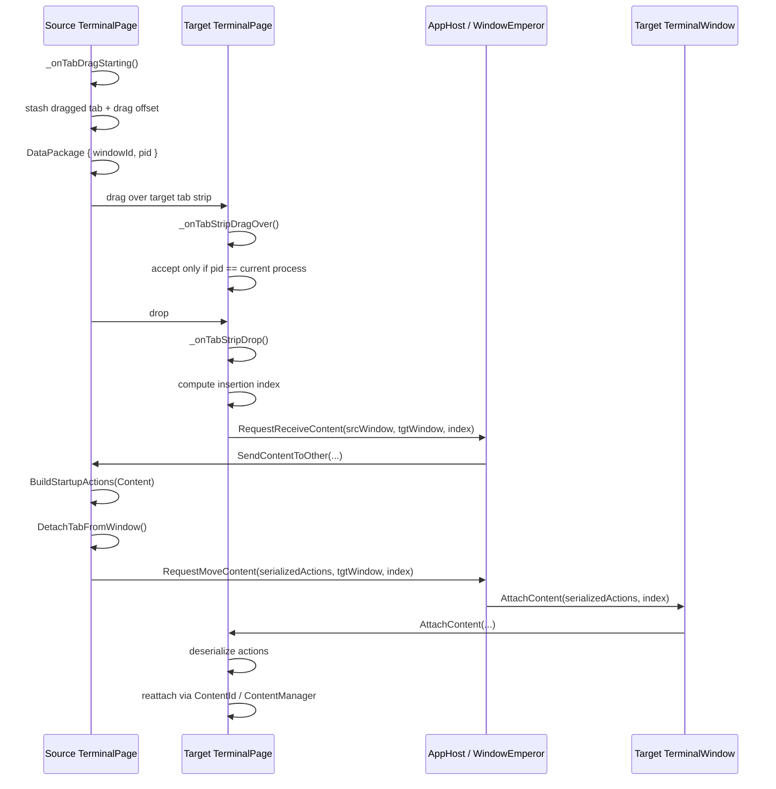

# Windows Terminal tab tear-out / hoisting research

## Executive summary

Short answer: **Windows Terminal does not hoist foreign top-level windows the way Project Window Manager does.**

What Windows Terminal actually does is closer to **moving an app-owned terminal session/content object between app-owned visual hosts**. The transferable idea for this project is the **architecture**:

- separate **logical content/session identity** from the **visual host**
- make drag/drop carry only **routing metadata**
- have a central manager coordinate the move
- reconstruct a fresh host around existing content in the destination

The part that is **not** transferable is the core mechanism. Windows Terminal can do this because it owns the tab content, renderer, swapchain, input pipeline, and process model. Project Window Manager hosts **arbitrary foreign HWNDs** using `SetParent`, which is a fundamentally different and much less cooperative environment.

My conclusion is:

- **Directly replicating Windows Terminal's tear-out/reattach model for arbitrary external app windows is not viable.**
- **Borrowing its session/container architecture ideas is viable and useful.**
- **A limited best-effort "move hosted window between our own hosts" feature may be viable for classic Win32 apps**, but it will still be much more fragile than Windows Terminal.

## Research scope

I reviewed:

- the local Windows Terminal checkout at `C:\ai-workspace\terminal`
- this repository at `C:\ai-workspace\project-wm`
- relevant Windows Terminal history and issue/PR discussions

Most important local source files:

- `src\cascadia\TerminalApp\TerminalPage.cpp`
- `src\cascadia\TerminalApp\TerminalPage.h`
- `src\cascadia\TerminalApp\TabManagement.cpp`
- `src\cascadia\TerminalApp\TerminalWindow.cpp`
- `src\cascadia\TerminalApp\TerminalWindow.h`
- `src\cascadia\TerminalApp\ContentManager.h`
- `src\cascadia\TerminalApp\ContentManager.cpp`
- `src\cascadia\TerminalApp\TerminalPaneContent.cpp`
- `src\cascadia\TerminalControl\TermControl.cpp`
- `src\cascadia\TerminalControl\ControlInteractivity.cpp`
- `src\cascadia\WindowsTerminal\AppHost.cpp`
- `src\cascadia\WindowsTerminal\WindowEmperor.cpp`
- `src\cascadia\TerminalApp\TabRowControl.xaml`

Most important historical references:

- `#5000` - Windows Terminal process model improvements
- `#14843` - "One process to rule them all"
- `#14866` - move panes/tabs between windows plumbing
- `#14901` - drag tabs between windows
- `#14935` - tear out tabs into new windows
- `#14900` - tab drag/drop/tear-out gaps megathread
- `#14957` - tear-out ship list
- `#16129` - Chromium parity for drag/drop

## Terminology note

Windows Terminal comments and PRs often talk about a **Monarch** and **Peasants**. In the current local checkout, the practical coordinating role for window-to-window moves is implemented inside the single-process model by:

- `WindowEmperor` as the process-level window manager
- `AppHost` as the per-window coordinator
- `TerminalWindow` / `TerminalPage` as the per-window UI/content logic

So when old comments say "goes to the monarch", read that as "goes up into the process-wide window manager path".

## The most important finding

**Windows Terminal is not transferring HWNDs between windows.**

It is transferring:

1. **drag metadata** in a `DataPackage`
2. **serialized startup actions** that describe tab/pane structure
3. **stable content IDs** that refer to already-existing terminal content in a process-wide `ContentManager`
4. then creating a **new `TermControl` host** in the destination window and reattaching the existing content to it

That is the key reason it works reliably enough for Terminal and does **not** map 1:1 to a `SetParent`-based foreign-window host.

## How Windows Terminal tabs work

### 1. Process model precondition: all windows live in one Terminal process

This is the prerequisite that makes the whole feature possible.

Historical design:

- PR `#14843` ("One process to rule them all") explicitly moved Windows Terminal to a **single-process** multi-window model.
- `WindowEmperor` manages global state and tracks all live windows.
- each window still has its own UI thread, but the process owns all windows together.

Current code evidence:

- `src\cascadia\WindowsTerminal\WindowEmperor.h`
- `src\cascadia\WindowsTerminal\WindowEmperor.cpp`

Important behavior:

- a new Terminal process first tries to hand off to an existing instance
- if one exists, the new process sends commandline payload via `WM_COPYDATA` and exits
- otherwise it becomes the active Terminal process and starts creating windows itself

Why this matters:

- drag/drop between Terminal windows is really **intra-process content transfer**
- Terminal can maintain a **process-wide content registry**
- moved content does not need to cross an arbitrary foreign process boundary

This is already a major difference from Project Window Manager, which manipulates unrelated external application windows.

### 2. UI wiring: same-window reorder and cross-window transfer are separate paths

Terminal uses WinUI `TabView`, but it splits behavior into two layers.

### Same-window reordering

Relevant files:

- `src\cascadia\TerminalApp\TabManagement.cpp`
- `src\cascadia\TerminalApp\TerminalPage.h`

Key methods:

- `TerminalPage::_TabDragStarted`
- `TerminalPage::_TabDragCompleted`
- `TerminalPage::_OnTabItemsChanged`
- `TerminalPage::_TryMoveTab`

How it works:

- WinUI `TabView` changes its visual `TabItems` collection during reorder
- Terminal watches those changes
- it records `from` and `to` indices while `_rearranging == true`
- on drag completion, it mirrors the reorder into Terminal's own logical `_tabs` collection

So even same-window reorder is not left entirely to the UI framework. Terminal keeps an explicit logical model of tabs and synchronizes it with the tab strip.

### Cross-window drag/drop and tear-out

Relevant files:

- `src\cascadia\TerminalApp\TerminalPage.cpp`
- `src\cascadia\TerminalApp\TerminalPage.h`
- `src\cascadia\TerminalApp\TabRowControl.xaml`

Key methods:

- `TerminalPage::_onTabDragStarting`
- `TerminalPage::_onTabStripDragOver`
- `TerminalPage::_onTabStripDrop`
- `TerminalPage::_onTabDroppedOutside`
- `TerminalPage::SendContentToOther`
- `TerminalPage::_sendDraggedTabToWindow`

Important XAML:

- `AllowDropTabs="True"`
- `CanDragTabs="True"`
- `CanReorderTabs="True"`

in `src\cascadia\TerminalApp\TabRowControl.xaml`.

Important nuance: `TabRowControl` also has drag/drop handlers on the new-tab button, but those are for file/path drop behavior, not tab tear-out plumbing.

### 3. What represents a dragged tab

When a drag starts, Windows Terminal does **not** package up the entire tab UI or a raw HWND.

In `TerminalPage::_onTabDragStarting` it does three important things:

1. stores the source tab in `_stashed.draggedTab`
2. stores a drag offset so the new window can be placed under the cursor sensibly
3. writes lightweight metadata into the WinUI drag `DataPackage`

The metadata written into the drag package is:

- `windowId`
- `pid`

That is it.

Meaning:

- the drag package identifies **who** the source is
- it does **not** contain the real content payload
- the content move happens later through internal window-manager calls

This is an important pattern: **the drag object is only a routing envelope**.

### 4. How drop onto another Terminal window works

### Acceptance

On the target side, `TerminalPage::_onTabStripDragOver` checks the incoming `DataPackage`.

It only accepts the drag if:

- `windowId` exists
- `pid` exists
- `pid == GetCurrentProcessId()`

That means current Windows Terminal tab dragging is intentionally scoped to **windows in the same Terminal process**. This is one of the clearest signs that the feature depends on shared process ownership.

### Drop target calculation

`TerminalPage::_onTabStripDrop` then:

- reads the source `windowId`
- walks the current tab strip items
- calculates the insertion index based on pointer position relative to existing tab headers

Then it raises:

- `RequestReceiveContentArgs(sourceWindowId, targetWindowId, tabIndex)`

### Window-manager handoff

The event goes up through the per-window host:

- `AppHost::_handleReceiveContent`

That method looks up the **source window** by ID and tells that source window's `TerminalWindow` logic to:

- `SendContentToOther(...)`

This is the crucial indirection:

- the target window does **not** pull content directly from the drag object
- it asks the process-wide manager to tell the source window to send it

### Source-side content send

On the source side, `TerminalWindow::SendContentToOther` forwards to `TerminalPage::SendContentToOther`.

That method validates:

- the request really targets the source window
- `_stashed.draggedTab` still exists

Then it calls:

- `_sendDraggedTabToWindow(targetWindowId, tabIndex, std::nullopt)`

### Actual move

`_sendDraggedTabToWindow` is the real work:

1. build startup actions from the dragged tab with `BuildStartupKind::Content`
2. detach the tab's content from the current window
3. raise `RequestMoveContent`
4. remove the tab from the source window

So the move is not "drag tab UI over there". It is:

> turn this tab into a portable description of its structure + stable content IDs, detach the old host, then rebuild it elsewhere.

### 5. How tear-out to a new window works

When the tab is dropped outside a `TabView`, Terminal runs `TerminalPage::_onTabDroppedOutside`.

What it does:

- gets current pointer position
- adjusts by the stored drag offset
- uses a magic target ID of `"-1"` to mean "make a new window"
- calls `_sendDraggedTabToWindow("-1", 0, adjustedPoint)`

That path is the same fundamental mechanism as window-to-window attach, but the destination does not exist yet.

### 6. How a new Terminal window is created for a torn-out tab

The cross-window move event comes up to:

- `AppHost::_handleMoveContent`

This method:

- interprets the destination window identifier
- if the target exists, calls `AttachContent`
- otherwise creates a new window via `WindowEmperor::CreateNewWindow`

When tearing out to empty space, it also computes initial window bounds very carefully:

- converts drag point from DIPs to pixels
- accounts for current DPI
- adjusts for non-client frame
- special-cases maximized source windows
- packages `InitialBounds` for the new window request

That is why torn-out Terminal tabs appear near the cursor with a sensible size.

### New-window startup path

New `AppHost` creation eventually calls:

- `TerminalWindow::SetStartupContent(content, bounds)`

not startup commandline actions.

This is important and explicitly guarded in `TerminalWindow::Create`:

> don't use normal settings startup actions during tear-out / reattach

That prevents new-window defaults from accidentally interfering with the moved content.

### 7. What content is actually moved

This is the core of the design.

### 7.1 Startup actions describe the tab/pane topology

Tabs and panes can be rebuilt as action sequences.

Relevant files:

- `src\cascadia\TerminalApp\Pane.cpp`
- `src\cascadia\TerminalApp\TerminalPaneContent.cpp`

`Pane::BuildStartupActions(...)` serializes the pane/tab structure into actions such as:

- `newTab`
- `splitPane`
- `moveFocus`

For moved content, Terminal uses `BuildStartupKind::Content` (or `MovePane` for pane-specific flows).

### 7.2 `ContentId` is the stable identity for existing terminal content

This is the most important field.

In `TerminalPaneContent::GetNewTerminalArgs(...)`, when the build kind is `Content` or `MovePane`, Terminal writes:

- `args.ContentId(_control.ContentId())`

That means the serialized action stream says:

> when you rebuild this tab, do not create a fresh terminal session here if possible; reattach to the existing content object with this ID.

### 7.3 `ContentManager` is the process-wide content registry

Relevant files:

- `src\cascadia\TerminalApp\ContentManager.h`
- `src\cascadia\TerminalApp\ContentManager.cpp`

The header comment is explicit:

- `TermControl`s are **not** thread-agile
- the underlying content **is**
- `ContentManager` exists as a singleton-ish helper across all Terminal threads
- it allows content to be detached from one control and reattached to another control on a different UI thread

This is the architectural secret sauce.

### 7.4 `TermControl` is disposable; `ControlInteractivity` survives

Relevant files:

- `src\cascadia\TerminalControl\TermControl.cpp`
- `src\cascadia\TerminalControl\ControlInteractivity.cpp`

Important behavior:

- `TermControl::Detach()` detaches the interactivity/core from the current UI control
- `ContentManager::Detach(control)` calls that detach path
- `TerminalPage::_AttachControlToContent(contentId)` asks `ContentManager` for the content object
- `TermControl::NewControlByAttachingContent(content)` creates a new `TermControl` host
- `_initializeForAttach()` reattaches the swapchain to a new XAML `SwapChainPanel`
- `ControlInteractivity::AttachToNewControl()` reconnects the content core to the new UI control

So the move is basically:

> same terminal session, same core content, new visual shell

### 8. What Windows Terminal is *not* doing

Windows Terminal is **not**:

- reparenting a foreign top-level application window into another top-level window
- transferring a raw HWND from one window to another as the primary mechanism
- moving a `TabViewItem` or full XAML tree directly between windows
- serializing tab content only as pixels or screenshots

It is also **not** using `SetParent` for tab tear-out.

I searched the local repo for `SetParent`. The relevant hit is in:

- `src\cascadia\WindowsTerminal\WindowEmperor.cpp`

That `SetParent` is used to parent an internal `CoreWindow` to a hidden window for WinUI/taskbar housekeeping. It is **not** the tab-transfer mechanism.

There is also a separate Terminal concept of an "owning HWND" for ConPTY/message-box behavior in:

- `TerminalPage::Initialize(HWND hwnd)`

That is for ownership of console-related windows/dialogs, not tab movement.

### 9. Sequence diagram for drag between existing Terminal windows



## Why Windows Terminal's approach works

Windows Terminal succeeds here because all of these are true:

1. **Terminal owns the content**
   - terminal session core
   - renderer / swapchain
   - input pipeline
   - tab/pane logical model

2. **Terminal owns both ends of the move**
   - source host
   - target host
   - process-wide window manager

3. **The content has a stable identity independent of the host**
   - `ContentId`

4. **The visual host is cheap to reconstruct**
   - new `TermControl`
   - existing content reattached

5. **All windows are inside one application architecture**
   - one Terminal process
   - known thread model
   - known UI stack

6. **The app is allowed to cooperate with itself**
   - detach old control cleanly
   - shut down and reconnect automation/rendering pieces
   - rebuild tab/pane structure from its own command model

Project Window Manager has almost none of those advantages when dealing with arbitrary external applications.

## Known Windows Terminal limitations and what they imply

Windows Terminal's implementation is good, but it is not "free". Even with app-owned content it still has a long tail of edge cases.

### Limitations called out in issue/PR history

From `#14900`, `#14957`, and `#16129`:

- drag/drop as admin is not supported
- there were DPI placement bugs
- tearing out from maximized windows required special handling
- single-tab / single-window behavior had edge cases
- there are still UX gaps vs Chromium/Edge
- isolated process mode disables tear-out entirely

### Why that matters to this project

If Terminal still has these issues **while moving content it owns**, then a foreign-window host that depends on `SetParent` should expect even worse edge cases:

- integrity level mismatches
- foreign process UI threads
- owned popups and modal dialogs
- framework-specific non-client areas
- wrapper windows like `ApplicationFrameWindow`
- multi-window apps
- HWND recreation on relaunch or state changes

## How Project Window Manager works today

Project Window Manager is much closer to classic Win32 reparenting.

Relevant files:

- `src\ProjectWindowManager.App\Controls\WindowHost.cs`
- `src\ProjectWindowManager.Win32\WindowManagerService.cs`
- `src\ProjectWindowManager.App\MainWindow.xaml.cs`
- `src\ProjectWindowManager.App\ViewModels\MainViewModel.cs`
- `src\ProjectWindowManager.Core\Models\ProjectModels.cs`
- `docs\bugs\001-hoisting\bug.md`

### Current flow

1. launch process
2. poll for a likely main HWND
3. call `ShowWindow(SW_HIDE)`
4. call `SetParent(child, host)`
5. scrub styles:
   - remove `WS_POPUP`
   - add `WS_CHILD`
   - remove caption/frame buttons for classic Win32 windows
   - add `WS_EX_TOOLWINDOW`
6. resize child to host client area
7. on switch, unhost old HWND and host new one

### Current model identity

The persistent model is `ManagedApplication`:

- `ExecutablePath`
- `DisplayName`
- `State`
- transient `LastActiveHwnd`

There is **no** independent logical content identity comparable to Terminal's `ContentId`.

### Current known issues

From `docs\bugs\001-hoisting\bug.md`:

- UWP / `ApplicationFrameWindow` handling is still fragile
- double-launch is not fixed
- some apps flash or float before being captured
- app switching can lose hosted state
- some app types still fail to embed correctly

This is a very different reliability envelope than Windows Terminal.

## Side-by-side comparison

| Dimension | Windows Terminal | Project Window Manager |
| --- | --- | --- |
| What is being hosted? | App-owned terminal content | Arbitrary foreign application windows |
| Core move mechanism | Detach content, create new host, reattach by `ContentId` | `SetParent` + style mutation on foreign HWND |
| Stable logical identity | `ContentId` + serialized action graph | mostly `ExecutablePath` + transient `HWND` |
| Who owns source and target? | Same application, same process model | One host app; source window belongs to unrelated external process |
| Can content outlive host UI? | Yes | Not in any controlled way |
| Recreate host in destination? | Yes, new `TermControl` | Only by reparenting same foreign window or finding a new HWND |
| Serialization of moved state | Yes, action graph plus content IDs | No meaningful equivalent for arbitrary third-party UIs |
| Win32 `SetParent` role | Internal housekeeping only, not tab move | Core feature mechanism |
| Cross-thread / lifecycle safety | Explicitly engineered in app | Depends on behavior of foreign process/framework |
| Expected reliability | Good but still edge-casey | Inherently fragile for some app classes |

## Is a similar approach viable for this app?

### Direct answer

### Not viable: replicate Windows Terminal literally

It is **not viable** to replicate Windows Terminal's actual tear-out architecture for arbitrary external windows, because Project Window Manager lacks the prerequisites Terminal depends on:

1. **no app-owned content object**
   - an external HWND is not equivalent to `ControlInteractivity`

2. **no stable content identity**
   - there is no foreign-app equivalent of `ContentId`

3. **no supported detach/reattach API from the foreign app**
   - you cannot ask a random Win32/UWP app to detach its renderer from one host and attach to another cleanly

4. **no portable action graph that reconstructs the same UI**
   - Terminal can rebuild tabs/panes because the whole model is its own
   - Project Window Manager cannot serialize arbitrary third-party UI state this way

5. **no control over renderer, swapchain, UIA, or input plumbing**
   - Terminal explicitly handles these during reattach
   - foreign apps do not expose this cooperation

6. **foreign window lifetime is not host-controlled**
   - the process can replace the HWND, create owned popups, or reject parenting assumptions at any time

### Potentially viable: borrow the architectural lessons

What *is* viable is to import the **design shape**, not the mechanism:

- introduce a first-class `HostedSession` / `HostedWindowSession`
- separate session identity from current `HWND`
- make drag/drop and move logic operate on sessions, not raw handles
- use a manager/orchestrator that routes move requests between host surfaces
- rebuild or reattach the destination host using the best strategy available for that session

That can improve your app even if the underlying foreign-window step still uses `SetParent`.

### What would be viable for Project Window Manager

#### 1. Session abstraction around hosted windows

This is the most valuable thing to copy from Terminal.

Introduce a model more like:

```csharp
public sealed class HostedSession
{
    public Guid SessionId { get; init; }
    public string ExecutablePath { get; init; } = "";
    public string DisplayName { get; init; } = "";

    public int? ProcessId { get; set; }
    public IntPtr CurrentHwnd { get; set; }
    public string? WindowClass { get; set; }
    public bool IsReparentable { get; set; }
    public HostedSessionState State { get; set; }

    public IntPtr OriginalParent { get; set; }
    public uint OriginalStyle { get; set; }
    public uint OriginalExStyle { get; set; }
}
```

That would let the app say:

- "move session X from host A to host B"

instead of:

- "attach HWND 0x123456 here"

This is the cleanest part of Terminal's design to emulate.

#### 2. Explicit detach / attach pipeline

If you ever add multiple host panes or multiple top-level Project Window Manager windows, use an explicit move sequence:

1. validate session is movable
2. snapshot current host state
3. unhost current HWND
4. host it in the destination
5. rollback if destination host fails

That is not the same as Terminal's content reattach, but the orchestration model is similar.

#### 3. Best-effort move of classic Win32 windows between your own hosts

This is probably the closest practical feature to Terminal-style tab tear-out in this app.

For **classic Win32 apps only**, you may be able to support:

- move hosted window from one Project WM pane/window to another

using your existing techniques:

- `UnhostWindow(hwnd)`
- `HostWindow(hwnd, newParent)`

However, this should be treated as:

- best effort
- opt-in
- class/process-filtered

I would not promise this for:

- `ApplicationFrameWindow`
- UWP wrappers
- apps with custom titlebar/non-client rendering
- apps with lots of owned popups/dialogs
- elevated apps crossing integrity boundaries

#### 4. Clear separation between "session transfer" and "window recapture"

Terminal can move existing content without launching a new session.

Project Window Manager should instead distinguish two cases:

### A. same live HWND, new host

Possible for some classic Win32 apps.

### B. session survives but needs recapture

Possible if:

- app restarted
- HWND changed
- wrapper window changed

In that case your session manager should recapture a new HWND and reconnect it to the existing logical session entry.

That would already be a significant architectural improvement over today's `LastActiveHwnd`-centric design.

### What is *not* viable to copy

#### 1. A `ContentManager` equivalent for arbitrary external windows

Terminal's `ContentManager` works because it manages Terminal-owned `ControlInteractivity` objects.

There is no general equivalent for:

- Notepad
- Calculator
- Explorer
- random Electron app
- random WPF app

You do not have an internal object behind those UIs that you can detach from one host and reattach to another.

#### 2. Rebuilding foreign app UI from serialized actions

Terminal can serialize:

- new-tab args
- split-pane topology
- focus state
- content IDs

You cannot serialize arbitrary third-party app state at that level unless the app itself exposes an API for it.

#### 3. Treating HWND as if it were Terminal's `ContentId`

This would be a trap.

An HWND is:

- transient
- framework-dependent
- often replaced
- not a stable logical identity

Terminal's `ContentId` is intentionally stable within the process-wide content registry. Those are not comparable.

#### 4. Assuming `SetParent` is evidence of similar design

The resemblance is superficial.

Yes, both systems involve windows and host surfaces.

But:

- Project Window Manager's core trick is **Win32 reparenting of foreign windows**
- Windows Terminal's core trick is **logical content transfer + host reconstruction**

Those are very different systems.

### Practical recommendation for this project

#### Recommendation 1: adopt Terminal's architecture pattern, not its mechanism

Good ideas to copy:

- session identity separate from live view host
- explicit move coordinator
- routing metadata during drag/drop
- destination index / destination window as first-class move parameters
- a clean distinction between "move within host", "move to other host", and "tear out to new window"

#### Recommendation 2: keep `SetParent` as a legacy/interop hosting strategy

For external arbitrary applications, `SetParent` is still your only generic tool here.

Treat it as one capture strategy among others:

- `SetParent` capture for classic Win32
- wrapper/frame capture for special cases
- maybe future cooperative/embed APIs for owned content

But do not build the whole architecture around the assumption that reparented foreign HWNDs behave like Terminal tabs.

#### Recommendation 3: explicitly scope any future "tear-out" feature

If you build a Windows-Terminal-inspired transfer feature, scope it like this:

### Safe-ish v1 scope

- only classic Win32 top-level windows
- only same-integrity-level windows
- only windows detected as non-owned, visible, non-cloaked
- modal dialogs stay floating
- UWP / `ApplicationFrameWindow` disabled or warned

### Out of scope for v1

- UWP rehost parity
- perfect stateful restore
- arbitrary dialog/pop-up capture
- seamless admin/non-admin transfer
- Chromium-level drag UX

#### Recommendation 4: if you want true Terminal-like behavior, only do it for content you own

A real Windows-Terminal-style design becomes viable if the hosted thing is something your app owns, such as:

- an embedded terminal control
- a WebView2 instance
- a custom plugin view
- your own child-window-based tool panels

For those cases, a `ContentManager`-style approach absolutely makes sense.

For arbitrary external apps, it does not.

### Concrete roadmap ideas for this repository

#### Phase 1 - make the current host model less HWND-centric

- add `SessionId` to managed applications
- split `ManagedApplication` logical identity from live capture state
- store original parent/style/exstyle when hosting
- track `ProcessId`, window class, and capture strategy

#### Phase 2 - add explicit move APIs

Evolve `IWindowManagerService` away from pure handle operations toward session-aware operations, for example:

```csharp
Task<LaunchResult> LaunchSession(string exePath, Guid sessionId, IntPtr hostHwnd);
bool TryMoveSession(Guid sessionId, IntPtr newHostHwnd);
bool TryRecaptureSession(Guid sessionId);
```

Internally those may still use `HWND`, but the app model would stop depending on `HWND` as the primary identity.

#### Phase 3 - support limited transfer between your own hosts

If the app later supports multiple content panes or multiple manager windows:

- enable drag/drop of `HostedSession` entries
- attempt detach/rehost for supported classes
- surface unsupported cases clearly instead of silently failing

#### Phase 4 - create a second path for app-owned content

If the project later embeds content you control:

- add a separate "owned content" host path
- use Terminal-style session/content abstractions there
- do not force foreign HWND hosting and owned content hosting through the same low-level mechanism

### Bottom-line answer to the original question

### Is Windows Terminal doing something similar to our hoisting?

**Only at a very high conceptual level.**

Both systems let something appear in a different window/container after user interaction.

But the implementation is fundamentally different:

- Project Window Manager hoists **foreign windows**
- Windows Terminal moves **owned session content**

### Is the same approach viable for our app?

**No, not literally.**

The Windows Terminal approach depends on owning the content and being able to detach and reattach it behind the UI. That does not exist for arbitrary third-party application windows.

### Is there still useful inspiration here?

**Yes, definitely.**

The useful inspiration is:

- model sessions separately from host surfaces
- route moves through a central coordinator
- make drag/drop carry identity, not payload
- separate "move/rehost" logic from "how the content is actually hosted"

That architectural shift would make Project Window Manager more robust, even if the final foreign-window step still relies on `SetParent`.

## Key source references

### Windows Terminal local code

- `src\cascadia\TerminalApp\TabRowControl.xaml`
  - drag-enabled `TabView`
- `src\cascadia\TerminalApp\TabManagement.cpp`
  - same-window reorder bookkeeping
- `src\cascadia\TerminalApp\TerminalPage.cpp`
  - drag start, drop, tear-out, content attach/send
- `src\cascadia\TerminalApp\ContentManager.h`
  - explanation of detachable content vs non-agile `TermControl`
- `src\cascadia\TerminalApp\ContentManager.cpp`
  - detach and lookup of content
- `src\cascadia\TerminalApp\TerminalPaneContent.cpp`
  - writes `ContentId` into move content args
- `src\cascadia\TerminalControl\TermControl.cpp`
  - attach existing content to a new control
- `src\cascadia\TerminalControl\ControlInteractivity.cpp`
  - detach/attach core interactivity
- `src\cascadia\TerminalApp\TerminalWindow.cpp`
  - startup content path and attach content path
- `src\cascadia\WindowsTerminal\AppHost.cpp`
  - move content / receive content routing
- `src\cascadia\WindowsTerminal\WindowEmperor.cpp`
  - process-wide window manager and new-window creation

### This repository

- `src\ProjectWindowManager.Win32\WindowManagerService.cs`
  - `SetParent`-based host/unhost logic
- `src\ProjectWindowManager.App\Controls\WindowHost.cs`
  - WPF `HwndHost` wrapper
- `src\ProjectWindowManager.App\MainWindow.xaml.cs`
  - active app switching
- `src\ProjectWindowManager.App\ViewModels\MainViewModel.cs`
  - launch/relaunch flow
- `src\ProjectWindowManager.Core\Models\ProjectModels.cs`
  - current logical model and transient HWND state
- `docs\bugs\001-hoisting\bug.md`
  - current fragility / limits

### Historical references

- `https://github.com/microsoft/terminal/pull/14843`
- `https://github.com/microsoft/terminal/pull/14866`
- `https://github.com/microsoft/terminal/pull/14901`
- `https://github.com/microsoft/terminal/pull/14935`
- `https://github.com/microsoft/terminal/issues/14900`
- `https://github.com/microsoft/terminal/issues/14957`
- `https://github.com/microsoft/terminal/issues/16129`
- `https://github.com/microsoft/terminal/issues/5000`
